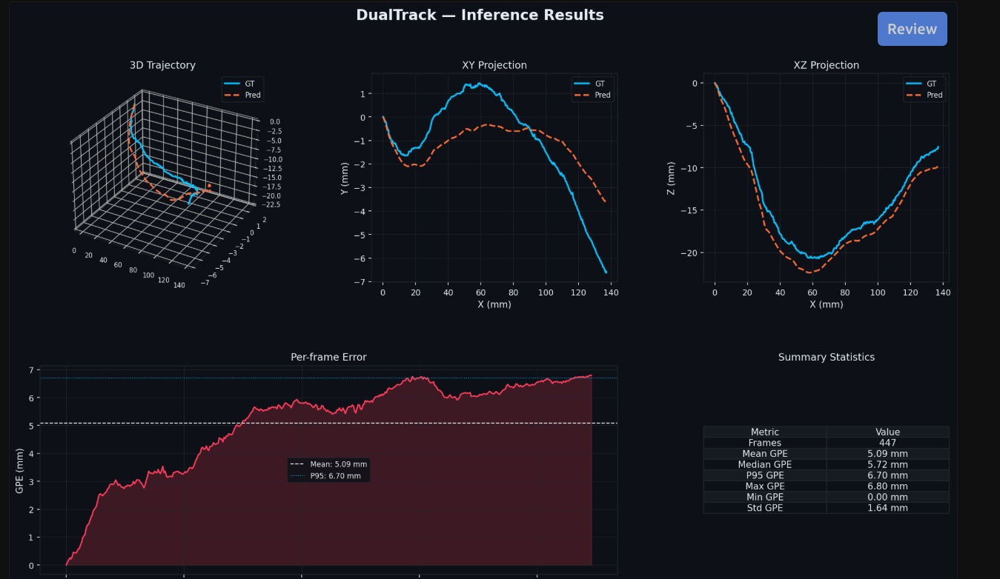

#  Neural Trajectory Estimation for Medical Imaging - Dualtrack Ultrasound Probe Pose Tracking

## Overview

This project aims to estimate the **6-DoF pose followed by 3D reconstruction of a freehand ultrasound probe** from a sequence of 2D ultrasound images.

The system follows a **Local + Global encoder architecture**, where:

- The **Local Encoder** focuses on short-term spatial and motion changes between frames.
- The **Global Encoder** captures long-range sequence-level information.
- The learned representations will be combined through a **Local-Global Fusion module** for improved pose estimation and reduced tracking drift.

---

## Overall Architecture

```text
                Ultrasound Sequence
                        │
              ┌─────────┴─────────┐
              │                   │
              ▼                   ▼
       Global Encoder        Local Encoder
              │                   │
      Global representations   Motion-aware
              │                 representations
              │                   │
              └─────────┬─────────┘
                        ▼
                Local-Global Fusion
                        │
                        ▼
                 6-DoF Pose Tracking
```

## Current Results


